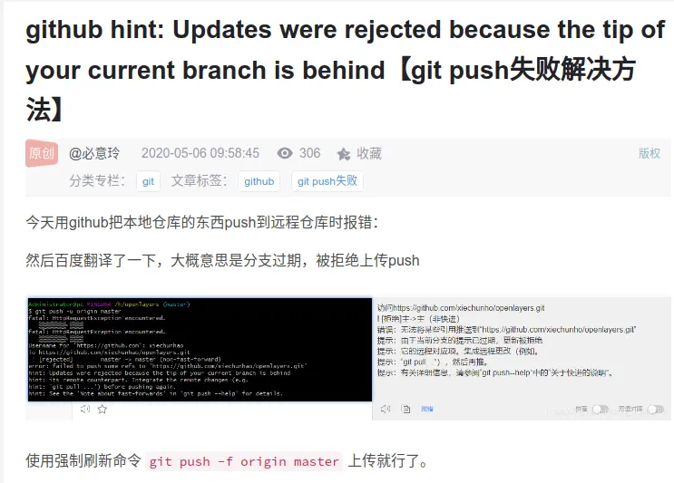

+++
title = "Git 从零开始的项目管理"
outputs = ["Reveal"]

[reveal_hugo]
custom_theme = "shuosc-dark-theme.scss"
custom_theme_compile = true
highlight_theme = "github-dark"

+++

# Git 入门 

从零开始的项目管理

by [SHUOSC](https://shuosc.org) & [SHUKAI](https://github.com/shukai-dev)

---

## 为什么要版本管理

{}
初稿.docx

第二稿.docx

第三稿.docx

……
{}

{}
终稿.docx
{}

{}
终稿（打死也不改了）.docx
{}

{}
~~终稿（打死也不改了）(1).docx~~
{}

---

{}

## 什么是 Git ？
- [分布式版本控制](https://zh.wikipedia.org/wiki/分散式版本控制)软件
- 最初由[林纳斯·托瓦兹](https://zh.wikipedia.org/wiki/林纳斯·托瓦兹)创作

---

## 为什么用 Git ？

- 个人开发
  - 创建项目的快照
  - 记录每个改动的目的
  - 基于多分支并行开发
- 团队协作
  - 看到别人对代码进行的修改
  - 解决由于并行开发引起的冲突

{}
现代的版本控制系统可以帮助您轻松地（甚至自动地）回答以下问题：
- 当前模块是谁编写的？
- 这个文件的这一行是什么时候被编辑的？是谁作出的修改？修改原因是什么呢？
- 最近的1000个版本中，何时/为什么导致了单元测试失败？
{}

{}

---

{}

## 学习 Git 你需要注意什么

- 理解 Git 的思想和基本工作原理
- 注重实践
- [提问的智慧](https://github.com/ryanhanwu/How-To-Ask-Questions-The-Smart-Way/blob/main/README-zh_CN.md)
- 学会上网

---

小心线上矛盾转换为线下矛盾


---


{}
这篇 XKCD 漫画 则反映出了人们对 Git 的评价

因为 Git 接口的抽象泄漏（leaky abstraction）问题，通过自顶向下的方式（从命令行接口开始）学习 Git 可能会让人感到非常困惑。很多时候您只能死记硬背一些命令行，然后像使用魔法一样使用它们，一旦出现问题，就只能像上面那幅漫画里说的那样去处理了。
{}

{}

---

{}

## Git 的安装

- 从[官网](https://git-scm.com/)下载安装
- 使用命令行安装：
  ```shell
  winget install git
  sudo apt install git
  brew install git
  ```
---

## Git 基础配置
- 设置你的用户名和邮件地址，
  ```shell
  git config --global user.name "John Doe"
  git config --global user.email johndoe@example.com
  ```
- 不加 `--global` 即表示对当前仓库单独配置

{}

---

{}

## Git 的基础用法

---

### 获取 Git 仓库

- 将尚未进行版本控制的本地目录转换为 Git 仓库
  ```shell
  git init
  ```
- 从其它服务器 `克隆` 一个已存在的 Git 仓库
  ```shell
  git clone https://github.com/libgit2/libgit2
  ```

---

### 记录每次更新到仓库

Git 目录下文件的 4 种状态：


---

#### 将文件加入暂存区

```shell
git status # 查看当前状态
git add README.md # 跟踪新文件或暂存已修改文件
git diff # 查看已暂存和未暂存的改动
```

---

#### 删除文件

```shell
rm README.md # 删除本地文件
git rm README.md # 同时删除本地和版本库中的文件
git rm --cached README.md # 移除文件但保留在工作目录，不再跟踪
```

---

#### 移动文件

```shell
git mv file_from file_to
```
等价于：
```shell
mv file_from file_to
git rm file_from
git add file_to
```

---

#### 关于`.gitignore`

- 存放在版本库根目录下的名为 `.gitignore` 的文件，规定忽略哪些文件
- 语法 [Git - gitignore Documentation](https://git-scm.com/docs/gitignore)
- `git check-ignore -v *file*`：查看某个文件是否被忽略，以及匹配的规则
- 常用语言的 `.gitignore` 模板：[github/gitignore](https://github.com/github/gitignore)

---

#### 提交更新

- `git commit`：默认编辑器编辑提交信息
- `git commit -m "*message*"`
- `-a (--all)` 自动暂存所有更改的文件
- [Angular 规范](https://www.conventionalcommits.org/zh-hans/v1.0.0/)

---

#### `git log` 查看提交历史

- `--oneline`：每一个提交一行
- `--graph`：显示分支结构
- `--stat`：显示文件删改信息
- `-p`：显示详细的修改内容

{}

#### 

---

{}

## Git 分支与合并

[Learn Git Branching](https://learngitbranching.js.org/)

---

<iframe src="https://learngitbranching.js.org/?locale=zh_CN" title="Learn Git Branching" width="1200" height="600">
  <p>Your browser does not support iframes.</p>
</iframe>

{}

---

## 参考资源

- [Pro Git (2nd Edition)](https://git-scm.com/book/zh/v2)
- [计算机教育中缺失的一课 - 版本控制(Git)](https://missing-semester-cn.github.io/2020/version-control/)
- [Learning Git Branching](https://learngitbranching.js.org/?locale=zh_CN)
- [Gazler/githug](https://github.com/Gazler/githug)
- [浙江大学计算机学院朋辈辅学课程「实用技能拾遗」lec2：Git/GitHub 基础介绍](https://slides.tonycrane.cc/PracticalSkillsTutorial/2023-spring-cs/lec2/)