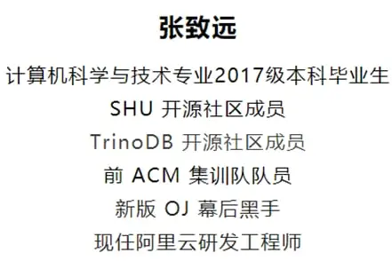
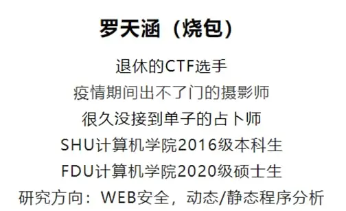
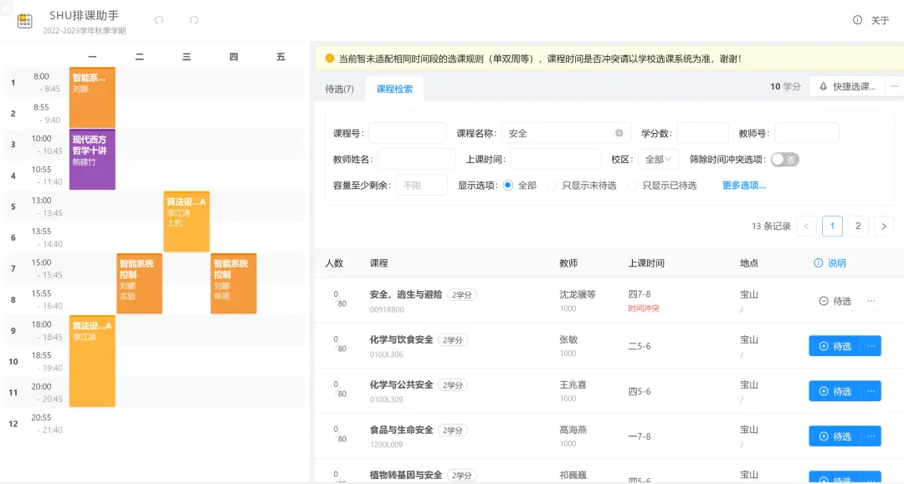
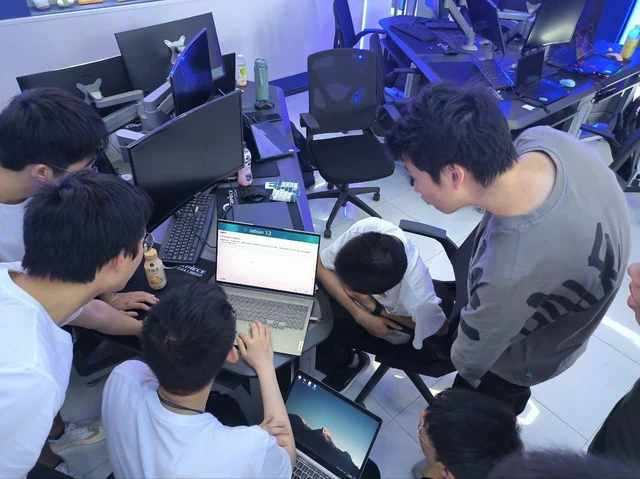

+++
title = "SHUOSC 2024 分流迎新宣讲"
outputs = ["Reveal"]

[reveal_hugo]
theme = "white"

[logo]
src = "img/shuosc_full.webp"
width = "10%" # Overrides diag.
+++

## SHUOSC 迎新宣讲

2024.6.16

---

{}

### 我们是谁

- 社团：爱好开源技术和文化的在校学生
- 社区：从2010年积累至今的校友圈和社会声望
  
---

供职名企的学长

- 互联网大厂、知名外企、游戏公司...
- 前后端开发、安全、架构师、创业者...

---

名校深造的学长

- 复旦、科大、中科院计算所...
- 卡耐基梅隆大学硕士、加州大学全奖直博...

{}

---

{}

### 我们能做什么

---

维护[排课助手](https://github.com/shuosc/shu-scheduling-helper/tree/v3)，服务全校学生

---

编制[溯源手册](https://shuosc.github.io/fly/)，记录前人经验

---

贡献开源项目，参与开源活动

---

交流技术生活，体验开源乐趣

--- 

新的想法由你去探索

- 帮助社区改进网站建设
- 开发实用的群聊天机器人
- ...

{}

---

{}

### 我们的组织架构

---

组织部

- 活动的策划与推动，保证线上/线下活动的质量
- 对接学校事务，与校内外组织机构开展交流合作
- 管理社区各项资产，维护财务与事务记录

---

技术部

- 管理 GitHub 组织，维护社区项目与代码
- 组队开坑，造新的轮子
- 自学 CS，互相交流技术

---

运营部

- 生产高质量内容，传播开源技术文化
- 运营 B 站和微信公众号等新媒体
- 活动宣发和记录，招新宣传

---

各类 SIG 兴趣小组

- 超算组：学习高性能计算，参加超算竞赛
- 安全组：学习安全技术，参加 CTF 竞赛
- 前端/Java/Python/漫研...如果你找得到人

{}

---

{}

### 我们在寻找谁

- 「异类」：爱好技术，乐于分享
- 「正常人」：不故作抽象，不盲目乱卷

---

### 你可以成为谁

- ~~Arch Linux User~~
- Independent Researcher
- Open-minded Lifehacker
- Self-motivated Learner

---

### 为什么参与开源

- CS 弱校自救的少数出路之一
- 后 GPT 时代的必备技能

> Just For Fun 
> ——[Linus Torvalds](https://en.wikipedia.org/wiki/Linus_Torvalds#Bibliography)

{}

---

{}

|  |  | 
| ---- | ---- |

---

微信公众号：SHU开源社区

B 站：上海大学开源社区

QQ 千人大群：24061199

招新答疑 QQ 群：713134660

逛逛 https://github.com/shuosc

多来线下活动混脸熟

{}