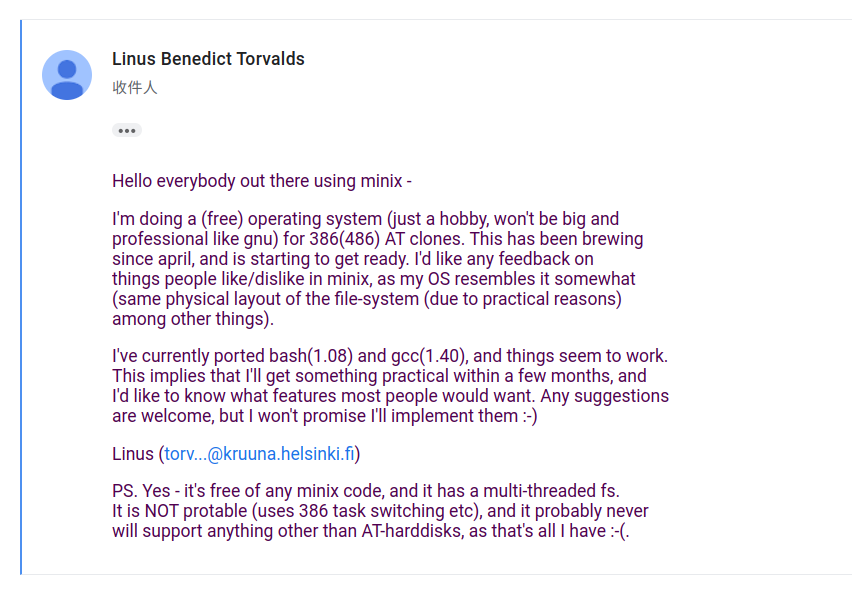
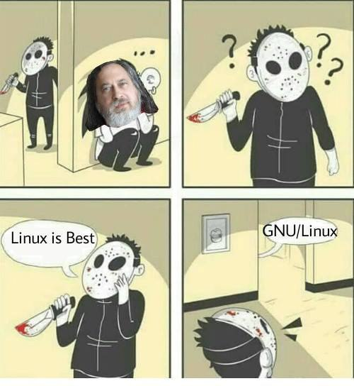
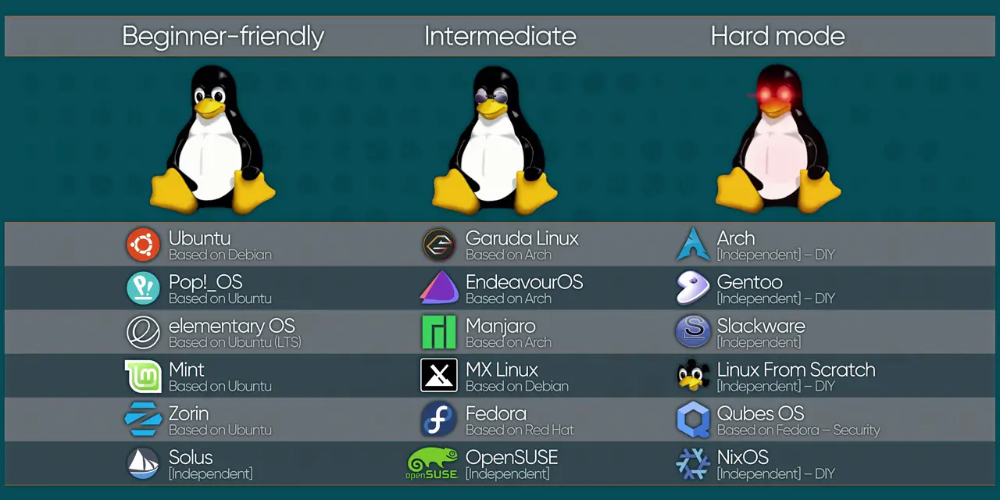

+++
title = "Linux Install Party"
outputs = ["Reveal"]

[reveal_hugo]
custom_theme = "shuosc-light-theme.scss"
custom_theme_compile = true

[logo]
src = "/shuosc.webp"
width = "7%" # Overrides diag.
+++

# Linux Install Party

by [SHUOSC](https://shuosc.github.io/)

---

{}

## [声明](https://www.gnu.org/gnu/linux-and-gnu.zh-cn.html)

- Linux 是内核，它只能在完整的操作系统框架下才能发挥作用

- Linux 一般和 GNU 软件一起使用：整个系统基本上就是 GNU 加上 Linux，或叫 GNU/Linux。

- 所有被叫做“Linux”的发行版实际上是 GNU/Linux 发行版。

{}

---

{}

## Linux 的历史

---
### 起源
- UNIX的诞生
- GNU 计划：开发一个完全自由的类Unix操作系统
- MINIX：用于教学的微内核架构的类Unix系统

---
### Linux的诞生
<a href="https://groups.google.com/g/comp.os.minix/c/dlNtH7RRrGA/m/SwRavCzVE7gJ">
    
</a>

---
### 什么是 GNU/Linux ？
<a href="https://zh.wikipedia.org/wiki/GNU/Linux%E5%91%BD%E5%90%8D%E7%88%AD%E8%AD%B0">
    
</a>

{}

---

{}

## 为什么选择 Linux

---

### 开源自由

Linux 是开源的，你可以自由地使用、复制、分发、学习、修改 Linux

---

### 安全稳定

由于 Linux 的开源性质，任何人都可以查看源代码，发现并修复漏洞

> Given enough eyeballs, all bugs are shallow. 
>   —— Linus' Law

---

### 轻量高效

- 遵循 [UNIX 哲学](https://zh.wikipedia.org/wiki/Unix%E5%93%B2%E5%AD%A6)“小即是美”
- 系统占用资源少，这使得 Linux 硬件下限极低
- 让你的老电脑焕发第二春

---

### 适合程序员

- 强大的命令行
- 方便的包管理器（apt, pacman...）
- 详细的报错提示和日志信息
- 接近实际服务器环境

---

### 自定义程度高

- 自定义内核(zen, lts, xanmod...)
- 自定义桌面环境(GNOME, KDE, XFCE, i3wm...)
- 自定义一切，理论上你可以自由修改 Linux 的任何开源代码并编译安装，~~让她彻底变成你的形状~~

---

### Linux 应用实例

- 服务器、超算
- 路由器
- Android
- ...

---

### 日常使用

- 办公学习
- 娱乐
- 开发
- ...

{}

---

{}

## Linux 常见发行版介绍

[适合自己](https://distrochooser.de/zh-hans)的才是最好的

---



---
### 

- 固若金汤，稳定性极强
- 坚守 UNIX 和自由软件的精神
- 支持众多计算机架构
- 众多发行版的直接上游或源头

---
### 

- 简单易上手，适合新手
- 基于 Debian，有着丰富软件源
- Canonical 公司运营，~~商业推广出色~~
- 群众基础广泛，有大量的教程和问答

---
### 

- 遵循 [KISS 原则](https://zh.wikipedia.org/wiki/KISS%E5%8E%9F%E5%88%99)，简单高效
- 滚动更新，永不过时
- 极其丰富的软件源（包括用户自制的AUR）和积极的社区支持
- [Arch Wiki](http://wiki.archlinux.org/) 是 Linux 社区最好的 Wiki
- 适合有 DIY 需求的用户

---
### 

- 基于 Arch Linux，但安装更友好，适合新手
- 界面美观，自带驱动，可更换内核
- 能沿用 Arch Linux 的软件源和文档（易出问题

---
### 

- 基于 Arch Linux，但安装更友好
- 界面美观，保持精简，适合 DIY 用户
- 直接使用 Arch Linux 软件源，与上游完全同步

---
### 

- 由 Red Hat 公司赞助，CentOS/RHEL 的上游
- 有着丰富的软件源
- Linus Torvalds 使用的发行版
- 适合有一定 Linux 基础的用户
---
### 

- 新手友好，易于上手，有着优秀的桌面环境体验
- 特性丰富，YaST 以简便直接的形式控制系统的一切
- 坚如磐石，比较稳定，有社区和商业支持
---
### 

- 多语言支持开箱即用
- 各架构体验统一且优化充分
- 预装针对特定地区的网络连通工具
---
### 

- 专注于渗透测试，内置大量渗透工具
- ~~KALI 学得好，牢饭吃到饱~~

---
### 

- 勤快一时，懒惰一世
- 适合对性能有极高要求的用户

---
### 

- 声明式配置，纯函数式包管理
- 原子化升级和回滚
- 易于复现系统环境，安全稳定
- 适合进阶用户

---
### 

- 社区驱动，~~起夜级~~稳定
- CentOS 7 将于 2024 年 6 月 30 日停止维护
- 所有 CentOS 用户都应该尽快将生产环境迁移到 Rocky Linux 等替代品

{}

---

{}

## Linux 桌面环境速览

桌面环境=Desktop Environment(DE)

---

### Linux 桌面环境的特点

- 桌面环境可单独安装，独立于发行版
- 不同桌面环境风格各异，提供丰富的软件选择
- 稳定性在逐渐提升，完全满足日用需求

---

### GNOME


---
### KDE


---

### Xfce


{}

---

{}

## Linux 安装的 N 种方式

---

### 获取 Linux 系统安装介质

- 和 Windows 一样，安装介质通常是 ISO 文件
- 可就近选择镜像站下载
  - [清华大学开源软件镜像站](https://mirrors.tuna.tsinghua.edu.cn/)
  - [中国科学技术大学开源软件镜像站](http://mirrors.ustc.edu.cn/)
  - [校园网联合镜像站](https://mirrors.cernet.edu.cn/os)
  - [腾讯软件源](http://mirrors.cloud.tencent.com/)

---
### 实体机安装

- 性能最好，体验最真实
- 需要对磁盘分区和系统启动方式有一定了解
- 步骤：
  - 用Ventoy等工具将ISO文件装入至U盘
  - 开机从U盘启动Live系统或安装程序

---

### 虚拟机安装

- 无需重启，管理方便
- 隔离性好，安全稳定
- 步骤：
  - 用VMware/VirtualBox等软件创建虚拟机
  - 在虚拟机设置插入ISO文件

---

### WSL 安装

- 性能损耗低
- 区分 WSL1/WSL2
- 与 Windows 无缝集成

---

### 容器安装

- 使用 Podman/Docker 等容器方案可以便捷创建轻量的 Linux 环境
- 借助 [Termux](https://f-droid.org/zh_Hans/packages/com.termux/) 和 proot/chroot 容器可以实现在 Android 设备上运行 Linux 系统

```shell
pkg install proot proot-distro
proot-distro install debian
```

{}

---

{}

## Linux 用户遇到问题该怎么办？

---

### 自力更生

- RTFM: Read The Manual
- STFW: Search The Web

---

### 社区支持

[提问的智慧](https://lug.ustc.edu.cn/wiki/doc/smart-questions/)

- Forum/BBS
- Telegram/QQ Group

{}

---

{}

## Talk is cheap, let's install Linux.

{}
