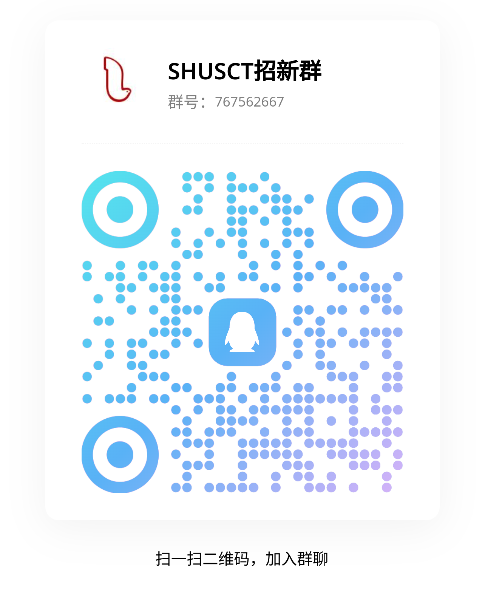
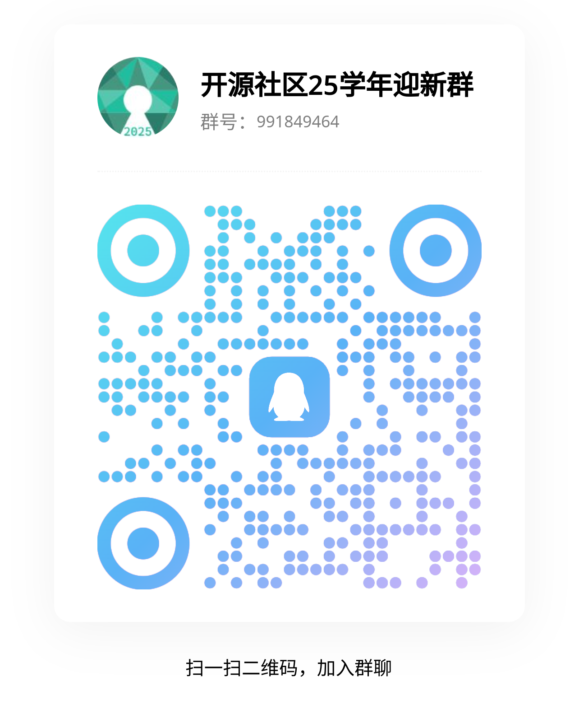

+++
title = "SHUOSC 2026 迎新"
outputs = ["Reveal"]

[reveal_hugo]
theme = "white"

[logo]
src = "img/shuosc_full.webp"
width = "10%" # Overrides diag.
+++

## SHUOSC 迎新宣讲

2026.3.15

---

{}

### 我们是谁

- 社团：爱好开源技术和文化的在校学生
- 社区：从2010年积累至今的校友圈和社会声望
- LUG:  各种前沿技术的用户

---

供职名企的学长

- 互联网大厂、知名外企、游戏公司...
- 前后端开发、安全、架构师、创业者...

---

名校深造的学长

- 复旦、科大、中科院计算所...
- 卡耐基梅隆大学硕士、加州大学全奖直博...

{}

---

{}

### 我们能做什么

---

恢复[排课助手](https://github.com/shuosc/shu-scheduling-helper/tree/v3)，服务全校学生

*旧选课助手还未完成适配，新版正在开发中*

---

贡献开源项目，参与开源活动

---

组队开坑，造新的轮子
[``](https://github.com/codecrafters-io/build-your-own-x)

---

找到和你一起学公开课做 Lab 的人
[``](https://csdiy.wiki/)

---

交流技术生活，体验开源乐趣

---

### 有“活儿”的线下活动

有趣和有含金量的技术方向分享

- 2016年Lisp 长期学习会
- Rust并发?  RESTful？Vue？
- Nix User
- 计算机编曲？Zig? 编译器？ DSL?

---

新的一系列基础设施

- 新一代前端技术的实验探索
- 重写社团网站
- 适配GitLab\,Overleaf等公共资源
- 万一镜像站恢复了呢？

---

新的想法由你去探索

- 帮助社区改进网站建设
- 开发实用的群聊天机器人
- 光速Vibe出新的小项目
- ...

{}

---

{}

### 我们在寻找谁

- 「异类」：爱好技术，乐于分享，有[ Hacker 精神](https://en.wikipedia.org/wiki/Hacker_culture)
- 「正常人」：不故作抽象，不盲目乱卷

---

### 你可以成为谁

- ~~Arch Linux User~~
- Independent Researcher
- Open-minded Lifehacker
- Self-motivated Learner

---

### 为什么参与我们

- 抱团取暖： 不论你是
  - 硬件爱好者
  - Vibe coding爱好者
  - 寻找LUG
  - 理论爱好者
  - 竞赛，战斗，爽
  - 都可以在我们这里找到爱好者
- 寻找路径：
  - 对于代码怀有恐惧
  - 缺乏经验
  - 只要有好奇心和决心我们都愿意接纳，哪怕我们很菜，也会与你一同学习

---

### 为什么参与开源

- CS 弱校自救的少数出路之一
- 后 ~~GPT~~AGENT 时代的必备技能

> Just For Fun
> ——[Linus Torvalds](https://en.wikipedia.org/wiki/Linus_Torvalds#Bibliography)

---

- 我们都是活生生的人，从小就被不由自主地教导用最小的付出获得最大的得到，经常会忘记我们究竟要的是什么。我承认我完美主义，但我想每个人心中都有那一份求知的渴望和对真理的向往，"大学"的灵魂也就在于超越世俗，超越时代的纯真和理想。我们不是要讨好企业的毕业生，而是要寻找改变世界的力量。—— [jyy](https://jyywiki.cn/)

---

- 学计算机一定要有一个非常强大的心理状态，计算机的所有东西都是人做出来的，别人能想的出来的我也一定能想的出来，在计算机里头没有任何黑魔法，所有的东西只不过是我现在不知道而已，总有一天我会把所有的细节、所有的内部的东西全搞明白的。—— 翁恺

{}

---

{}

### 我们的组织架构

---

组织部

- 活动的策划与推动，保证线上/线下活动的质量
- 对接学校事务，与校内外组织机构开展交流合作
- 管理社区各项资产，维护财务与事务记录

---

技术部

- 管理 GitHub 组织，维护社区项目与代码
- 配合组织部进行不定期的简单技术分享

---

运营部

- 生产高质量内容，传播开源技术文化
- 运营 B 站和微信公众号等新媒体
- 活动宣发和记录，招新宣传

---

各类 SIG 兴趣小组

- [超算组](https://github.com/SHUSCT)：学习高性能计算，参加超算竞赛
- [安全组](https://github.com/shu-cake1salie)：学习安全技术，参加 CTF 竞赛
- 前端/Java/Python/漫研...如果你找得到人

{}

---

{}

|  |  |
| ----------------- | ------------------------- |

---

微信公众号：SHU开源社区

B 站：上海大学开源社区

招新答疑 QQ 群：991849464

逛逛 https://github.com/shuosc

多来线下活动混脸熟

{}
